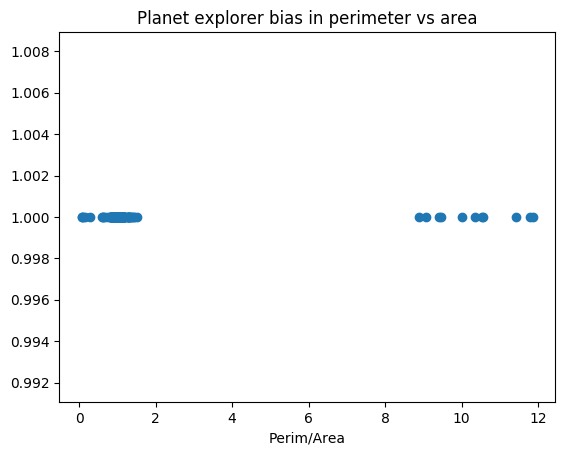
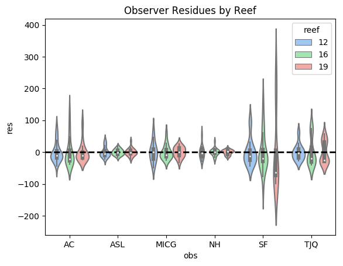
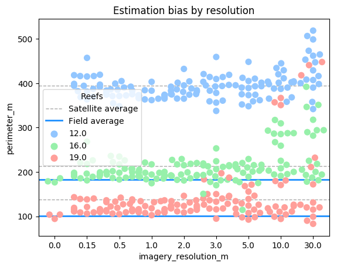

```{r setup, include=FALSE}
knitr::opts_chunk$set(echo = TRUE)
```
# Measuring Reefs
An exploratory view into using satellite imagery from multiple sources, referenced against ground-truthed observations, as part of a technology integrated workflow. Ideally the satellite imagery would be as good as the field work, allowing for a new tool to be used.

## Methods

### Field work
The field observations were conducted with 2 independent teams. Both teams started from a unified position at a fixed depth, and then measured the perimeter heading in opposite directions. The route taken was at an approximate fixed depth contour. One team used 30m transect tapes, while the second team used a 100m tape. Afterwards, the diameters of the reefs were measured with fixed compass bearings, with two orthogonal measurements taken.

### Satellite Imagery
The satellite imagery came from a multitude of sources from within **Google Earth** and **Planet Explorer**. Details on the satellites, resolutions, and dates can be found in the `Data\ASL_data.csv` table. A summary is given below.

Resolution (m)  | Satellite                             | Provider     | 
--------------- | ------------------------------------- | ------------ |
3.00            | PlanetScope (formerly Dove CubeSats)  | Planet       |
5.00            | RapidEye                              | Planet       |
10.00           | Sentinel-2                            | ESA          |
30.00           | Landsat 8                             | USGS         |
0.15            | aerial imagery                        | Unknown      |
0.50            | WorldView-1/2, GeoEye-1, or Quickbird | DigitalGlobe |
1.00            | Ikonos                                | DigitalGlobe |
2.00            | EarlyBird-1                           | DigitalGlobe |

Each reef was measured for area and perimeter three times for each different source, enabling a simple check for observer biases.

## Results
Data analysed below (details later).
```{r,engine='python',python.reticulate=FALSE}
import pandas
import seaborn as sns
import matplotlib.pyplot as plt
import numpy as np
import scipy.stats

def loadData(file_):
    return pandas.read_csv(open(file_,'r'))

def plotResolutionBias(df):
    f,ax = plt.subplots()
    sns.swarmplot(x='imagery_resolution_m',y='perimeter_m',hue='reef_no', data=df,ax=ax,size=8,palette='pastel')

    for reef in (12,16,19):
        ax.axhline(np.mean(df.loc[(df['reef_no']==reef) & (df['method']=='imagery')]['perimeter_m']),lw=1,c='darkgray',ls='--',label='Satellite average' if reef==12 else None)
        ax.axhline(np.mean(df.loc[(df['reef_no']==reef) & (df['method']=='field')]['perimeter_m']),lw=2,c='dodgerblue',label='Field average' if reef==12 else None)
    plt.legend(title='Reefs')
    plt.title('Estimation bias by resolution')
    f.savefig('foo3.png', bbox_inches='tight')
    #plt.show(block=False)

def plotObserverBias(df):
    f, ax = plt.subplots()
    observers=('AC', 'ASL', 'MICG', 'NH', 'SF', 'TJQ')
    full_data=[]
    for reef in (12,16,19):
        for obs in observers:
            mean = np.mean(df.loc[(df['observer']==obs) & (df['reef_no']==reef) & (df['method']=='imagery')]['perimeter_m'])
            vals = np.array(df.loc[(df['observer']==obs) & (df['reef_no']==reef) & (df['method']=='imagery')]['perimeter_m'])
            residues = vals - mean
            for res in residues:
                full_data.append({'reef':reef,'obs':obs, 'res':res})
           # plt.scatter([observers.index(obs)]*len(residues),residues)
        #plot.scatter()
    dq=pandas.DataFrame(full_data)
    sns.violinplot(x='obs',y='res',hue='reef',data=dq,palette='pastel')
    ax.axhline(0,lw=2,ls='--',c='k')
    plt.title('Observer Residues by Reef')
    f.savefig('foo2.png', bbox_inches='tight')
    #plt.show(block=False)
    ##residues

def plotCorrelation(df):
    f,ax=plt.subplots()
    for reef in (12,16,19):
        data = df.loc[df['platform']=='PlanetExplorer']
        res=[]
        for j,i in data.iterrows():
            if np.isnan(i[3]):
                continue
            res.append((i[3]**2/(3.14*4))/i[4])

    plt.scatter(res,[1]*len(res))
    plt.title('Planet explorer bias in perimeter vs area')
    plt.xlabel('Perim/Area')
    f.savefig('foo.png', bbox_inches='tight')
    #plt.show(block=False)

def doStats(df):
    for reef in (16,19):
        imagery = np.array(df.loc[(df['reef_no']==reef) & (df['method']=='imagery')]['perimeter_m'])
        field = np.array(df.loc[(df['reef_no']==reef) & (df['method']=='field')]['perimeter_m'])

        print('Reef size: {}, p_value = {}'.format(reef,scipy.stats.ttest_ind(imagery,field,equal_var=False, nan_policy='omit')[1]))
        
        
dx = loadData('data/groupdata.csv')   
plotResolutionBias(dx)
plotObserverBias(dx)
plotCorrelation(dx)
```





## Discussion
While the data collected is limited (partly due to a potential tiger shark incident), there are several take aways. The lower resolution satellite imagery, in this context, was useless, with some reefs occupying a single pixel. With a small "truth" sample, we find a statisical difference between the two methods, indicating that this is not a direct proxy (at least without a correction factor). More samples would be needed to strengthen this claim.

However, the collection time is particularly worth noting. The collection time for satellite imagery essentially scales as O(1), while studying larger reefs in the field struggles with O(R). Additionally, for more remote reefs this method is also very powerful. Overally integrating remote sensing into reef measurements has significant value, particularly as the weakeness of imagery (resolution and ease of access) improve constantly.

