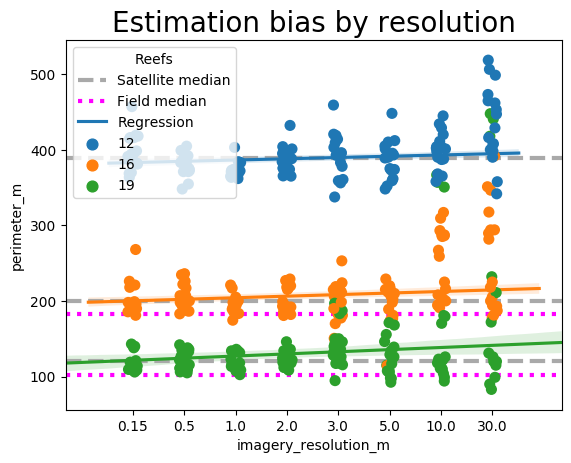
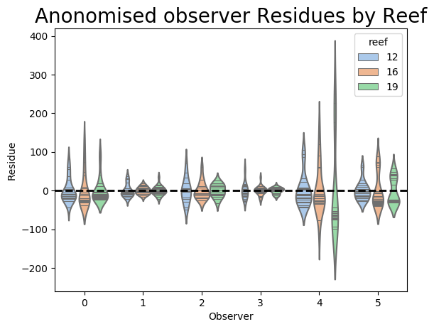
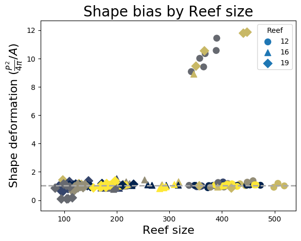

Measuring Reefs (Module 1)
================
Alexander Leonard
2019-05-23

# Measuring Reefs

An exploratory view into using satellite imagery from multiple sources,
referenced against ground-truthed observations, as part of a technology
integrated workflow. Ideally the satellite imagery would be as good as
the field work, allowing for a new tool to be used.

## Methods

### Field work

The field observations were conducted with 2 independent teams. Both
teams started from a unified position at a fixed depth, and then
measured the perimeter heading in opposite directions. The route taken
was at an approximate fixed depth contour. One team used 30m transect
tapes, while the second team used a 100m tape. Afterwards, the diameters
of the reefs were measured with fixed compass bearings, with two
orthogonal measurements taken.

### Satellite Imagery

The satellite imagery came from a multitude of sources from within
**Google Earth** and **Planet Explorer**. Details on the satellites,
resolutions, and dates can be found in the `Data\ASL_data.csv` table. A
summary is given
below.

| Resolution (m) | Satellite                             | Provider     |
| -------------- | ------------------------------------- | ------------ |
| 3.00           | PlanetScope (formerly Dove CubeSats)  | Planet       |
| 5.00           | RapidEye                              | Planet       |
| 10.00          | Sentinel-2                            | ESA          |
| 30.00          | Landsat 8                             | USGS         |
| 0.15           | aerial imagery                        | Unknown      |
| 0.50           | WorldView-1/2, GeoEye-1, or Quickbird | DigitalGlobe |
| 1.00           | Ikonos                                | DigitalGlobe |
| 2.00           | EarlyBird-1                           | DigitalGlobe |

Each reef was measured for area and perimeter three times for each
different source, enabling a simple check for observer biases.

## Results
There were several interesting results to analyse. The first was to see if there was any bias from the imagery resolution on our measurements. This was analysed as follows.

```python
def plotResolutionBias(df):
    f,ax = plt.subplots()
    sns.stripplot(x='imagery_resolution_m',y='perimeter_m',hue='reef_no', data=df,ax=ax,size=8)

    for reef in (12,16,19):
        ax.axhline(np.median(df.loc[(df['reef_no']==reef) & (df['method']=='imagery')]['perimeter_m']),lw=3,c='darkgray',ls='--',label='Satellite median' if reef==12 else None)
        ax.axhline(np.median(df.loc[(df['reef_no']==reef) & (df['method']=='field')]['perimeter_m']),lw=3,ls=':',c='magenta',label='Field median' if reef==12 else None)
        sns.regplot(data=df.loc[df['reef_no']==reef],x='imagery_resolution_m',y='perimeter_m',ax=ax,scatter=False,label='Regression' if reef==12 else None)

    plt.legend(title='Reefs')
    plt.title('Estimation bias by resolution',fontsize=20)
    f.savefig('../figs/resolution_bias.png', bbox_inches='tight')
```

 

There is a slight trend to overestimating reef dimensions with more coarse-grained resolution, which is relatively understandable. However, it is a small trend and essentially all imagery provides reasonable estimations.

Next we can look at the bias from each observer, to see if there was a greater variation than for resolution. This was done as anonomously.

```python
def plotObserverBias(df):
    observers=('AC', 'ASL', 'MICG', 'NH', 'SF', 'TJQ')
    full_data=[]
    for reef in (12,16,19):
        for obs in observers:
            mean = np.mean(df.loc[(df['observer']==obs) & (df['reef_no']==reef) & (df['method']=='imagery')]['perimeter_m'])
            vals = np.array(df.loc[(df['observer']==obs) & (df['reef_no']==reef) & (df['method']=='imagery')]['perimeter_m'])
            residues = vals - mean
            for res in residues:
                full_data.append({'reef':reef,'Observer':observers.index(obs), 'Residue':res})

    dq=pandas.DataFrame(full_data)
    
    f, ax = plt.subplots()
    sns.violinplot(x='Observer',y='Residue',hue='reef',data=dq,palette='pastel',inner='stick',ax=ax)
    #ax.set_yticklabels(labels=range(len(observers)))
    ax.axhline(0,lw=2,ls='--',c='k')
    plt.title('Anonomised observer Residues by Reef',fontsize=20)
    
    f.savefig('../figs/observer_bias.png', bbox_inches='tight')
```


Clearly there is a large range of variation, which may confound the resolution bias, however, almost all observers found similar means, again indicating it is a reasonable quantity to use once averaged. There was also an effect from using circular geometry to measure the reefs in Google Earth, having much less variance due to the repeatability of the measurements.

Finally, we can look specifically at the Planet mesurements, to see if there was any great risk from having decoupled areas and perimeters, unlike in Google Earth where they were a single measurment.

```python
def plotCorrelation(df):
    data = df.loc[df['platform']=='PlanetExplorer']
    results=[]
    observers=('AC', 'ASL', 'MICG', 'NH', 'SF', 'TJQ')
    for _, row in data.iterrows():
        if np.isnan(row['perimeter_m']) or np.isnan(row['area_m2']):
            continue
        
        ##divergence from expected circular behaviour 
        results.append({'reef':row['reef_no'],'divergence':(row['perimeter_m']**2/(3.14*4))/row['area_m2'],'perimeter':row['perimeter_m'],'obs':row['observer']})

    df = pandas.DataFrame(results)

    f, ax = plt.subplots()
    markers={12:'o',16:'^',19:'D'}
    for reef, marker in markers.items():
        dataframe = df.loc[df['reef']==reef]
        ax.scatter(dataframe['perimeter'],dataframe['divergence'],c=[observers.index(i) for i in dataframe['obs']],cmap='cividis',s=75,marker=marker,label=reef)
        
    ax.axhline(np.nanmedian(df['divergence']),c='darkgray',ls='--',lw=2)

    ax.set_xlabel('Reef size',fontsize=16)
    ax.set_ylabel(r'Shape deformation ($\frac{P^2}{4 \pi} / A$)',fontsize=16)
    plt.legend(title='Reef')
    plt.title('Shape bias by Reef size',fontsize=20)
    f.savefig('../figs/correlation_bias.png', bbox_inches='tight')
```

 

This was broken down by reef (marker) and observer (colour), but seemingly was an outlier effect. The majority of the Planet measurements were consistent with an approximately circular geometry, with only a few measurements indicating a clear error. These errors occured with two observers and on multiple reefs, so it does not appear to by any systematic issue with the data collection.

## Discussion

While the data collected is limited (partly due to a potential tiger
shark incident), there are several take aways. The lower resolution
satellite imagery, in this context, was useless, with some reefs
occupying a single pixel. With a small “truth” sample, we find a
statisical difference between the two methods, indicating that this is
not a direct proxy (at least without a correction factor). More samples
would be needed to strengthen this claim.

However, the collection time is particularly worth noting. The
collection time for satellite imagery essentially scales as O(1), while
studying larger reefs in the field struggles with O(R). Additionally,
for more remote reefs this method is also very powerful. Overally
integrating remote sensing into reef measurements has significant value,
particularly as the weakeness of imagery (resolution and ease of access)
improve constantly.
